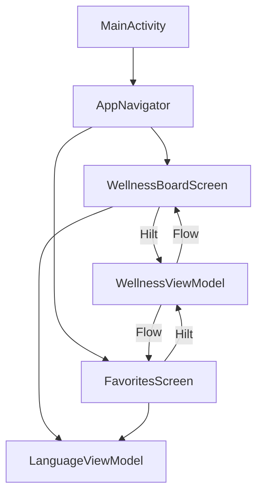

# Plum PM – AI‑Generated Wellness Recommendation Board (Android)

A Jetpack Compose Android app that generates bite‑sized wellness tips, lets you favorite them, and explore a clean, animated board UI. Built with MVVM, Hilt, Retrofit, Room (scaffolded), and Material 3. Includes adaptive icons and a polished splash experience on cold and warm starts.

---

## 1) Project Setup & Demo

- Android Studio (Giraffe/Koala+ recommended)
- JDK 17+ (use Android Studio’s bundled JDK)
- Android SDK Build Tools for API 34

Build and run:
```bash
# From project root
./gradlew :app:assembleDebug
# Windows
gradlew.bat :app:assembleDebug
# Or click Run in Android Studio
```

Install on device/emulator:
```bash
adb install -r app/build/outputs/apk/debug/app-debug.apk
```

Demo checklist (for your recording):
- Cold start: system splash (1.5s), then app content.
- Re-open from Recents: in‑app overlay splash (~1.2s).
- Pull‑to‑refresh with custom non‑spinner indicator (arrow + hint).
- Loading spinner with rotating phrases below it.
- List of wellness tips; toggle favorite; open Favorites screen.
- Optional: theme toggle if exposed in Sidebar.

---

## 2) Problem Understanding

Goal: Deliver a delightful, lightweight mobile experience that surfaces varied wellness tips with a clear visual hierarchy and smooth interactions.

Core user needs:
- Read short, helpful tips with clear titles, categories, and summaries.
- Pull down to generate fresh tips.
- Mark favorites and browse them separately.
- Smooth splash/onboarding experience that feels polished on every open.

Assumptions:
- “AI generation” can be mocked or backed by a real service later. Networking + ViewModel state is already wired to allow this swap.
- Tips are succinct, emoji‑enhanced, and categorized (e.g., sleep, focus, mindfulness).
- Room is scaffolded for persistence; scope may vary by assignment.

---

## 3) AI Prompts & Iterations (Template)

Use this section to document your own workflow. Example outline:

- Initial prompt:
  - “Create a wellness board UI with tips list, favorites, and pull‑to‑refresh using Compose. MVVM with Hilt.”
- Iteration highlights:
  - Splash: Added Android 12+ system splash (1.5s) and in‑app overlay on every foreground entry (~1.2s) with fade.
  - Pull‑to‑refresh: Prototyped elastic drop; finalized a minimal non‑spinner indicator with arrow + hint.
  - Loading UX: Added rotating, shuffled phrases beneath the spinner; increased interval to ~1.6s to reduce repetition feel.
  - Icons: Switched manifest to adaptive mipmaps and set `@drawable/logo` as foreground.

- Refined prompts:
  - Tightened copy for loading phrases.
  - Adjusted animations and delays for polish.

---

## 4) Architecture & Code Structure

Pattern: MVVM + Hilt DI + Jetpack Compose

- Entry point
  - `app/src/main/java/com/princemaurya/plum_pm/MainActivity.kt`
    - Android 12+ system splash via `installSplashScreen()` and 1.5s keep condition.
    - In‑app overlay splash on every foreground `ON_START` (fade in/out; centered logo + bottom tagline).
    - Hosts `AppNavigator`.

- Navigation & Screens
  - `ui/components/AppNavigator` – navigation host.
  - `ui/components/Sidebar` – quick actions/settings.
  - `ui/screen/wellnessboard/WellnessBoardScreen.kt`
    - Board UI with:
      - `SwipeRefresh` (Accompanist) + custom non‑spinner indicator (arrow + hint).
      - Loading state with shuffled phrases (“Planning next steps…”, etc.) crossfading every ~1.6s.
      - `WellnessTipCard`: emoji icon, title, category, summary, favorite toggle.
  - `ui/screen/favorites/FavoritesScreen.kt`
    - Favorites list and stats card.
    - Removed “Out of X total tips” line as requested.

- ViewModels
  - `ui/viewmodel/WellnessViewModel` – tips, favorites, loading/error state; actions:
    - `generateNewTips()`, `toggleFavorite(tip)`, `loadFavoriteTips()`.
  - `ui/viewmodel/LanguageViewModel` – language selection state (`currentLanguage`).

- Data Model
  - `com.princemaurya.plum_pm.data.model.WellnessTip` – used by both board and favorites UIs.

- Theming & Resources
  - `res/values/themes.xml` – `Theme.Plum_pm` and `Theme.Plum_pm.Splash`.
  - Adaptive icons:
    - `res/mipmap-anydpi-v26/ic_launcher.xml`
    - `res/mipmap-anydpi-v26/ic_launcher_round.xml`
    - Foreground `@drawable/logo`, background `@color/ic_launcher_background`.
  - Manifest icons:
    - `android:icon="@mipmap/ic_launcher"`
    - `android:roundIcon="@mipmap/ic_launcher_round"`

- Gradle
  - `app/build.gradle.kts`: compileSdk 34; Compose BOM; Material3; Hilt; Retrofit/OKHttp/Gson; Room; Accompanist SwipeRefresh; Lottie/Coil scaffolded.
  - Splash dependency: `androidx.core:core-splashscreen:1.0.1`.

Mermaid overview:


---

## 5) Screenshots / Screen Recording

Include in submission:
- Cold start system splash (1.5s), then main UI.
- Re‑open foreground overlay splash (~1.2s).
- Board screen with pull‑to‑refresh; custom indicator visible on pull.
- Loading spinner with rotating phrases.
- Favorites flow (toggle favorite; view in Favorites).
- Optional: light/dark theme.

---

## 6) Known Issues / Improvements

- Branding image attribute:
  - `windowSplashScreenBrandingImage` removed to fix resource linking with `core-splashscreen:1.0.1`. If you upgrade to a newer compatible version, re‑enable branding image.

- Pull‑to‑refresh:
  - Current indicator intentionally has no spinner; shows arrow + hint during drag only. Could replace with a small Lottie arrow/elastic animation.

- Localization:
  - `stringResourceLocalized(...)` is used; move any remaining hardcoded strings to `strings.xml` and provide translations.

- Persistence/Networking:
  - Room and Retrofit are configured. To plug in real AI:
    - Add an API interface and repository, inject via Hilt, and call in `WellnessViewModel.generateNewTips()`.

- UI polish:
  - Consider a shared Scaffold (top bar, snackbar) for consistent layout.
  - Add illustrations (Lottie) for empty/error states.

---

## 7) Bonus Work / Extra Polish

- Adaptive launcher icons with foreground logo.
- Cold and warm splash experiences (system splash + overlay splash).
- Animated favorite toggles (color + scale spring).
- Loading phrases with crossfade transitions and longer cadence for natural feel.
- Gradient backgrounds and Material 3 elevations/borders tuned for dark mode.

---

## 8) Extending With AI Backend

1. Define API (Retrofit):
   ```kotlin
   interface TipsApi {
       @GET("tips/new")
       suspend fun getTips(): List<TipDto>
   }
   ```
2. Repository:
   ```kotlin
   class TipsRepository @Inject constructor(private val api: TipsApi) {
       suspend fun fetchTips() = api.getTips().map { it.toDomain() }
   }
   ```
3. Inject into `WellnessViewModel` and call in `generateNewTips()` with proper loading/error states.
4. Optionally persist tips/favorites with Room DAOs.

---

## 9) Testing (Suggested)

- Unit tests: `WellnessViewModel` (loading → success/error, `toggleFavorite`).
- UI tests (Compose):
  - Pull‑to‑refresh indicator appears while dragging.
  - Loading phrases appear and rotate.
  - Favorites list reflects toggles.

---

## 10) Build & Dependencies

From `app/build.gradle.kts`:
- compileSdk 34, targetSdk 34, minSdk 24
- Compose Compiler Ext: 1.5.4
- Notable deps:
  - `androidx.core:core-splashscreen:1.0.1`
  - `com.google.dagger:hilt-android` (+ kapt compiler)
  - `com.squareup.retrofit2:retrofit` + `converter-gson`
  - `com.squareup.okhttp3:okhttp` + logging
  - `androidx.room:room-*` (runtime, ktx, kapt)
  - `com.google.accompanist:accompanist-swiperefresh`
  - `androidx.compose.material3:material3`
  - `io.coil-kt:coil-compose` (scaffolded)
  - `com.airbnb.android:lottie-compose` (scaffolded)

---

## 11) Submission Notes

- Attach APK or demo video and screenshots.
- Note any deviations from spec and rationale.
- Link to sections: architecture, known issues, bonus features.

---

## Appendix: Key Files

- `MainActivity.kt` – system splash (cold starts) + in‑app overlay splash (every foreground start), hosts UI.
- `ui/screen/wellnessboard/WellnessBoardScreen.kt` – board UI, pull‑to‑refresh, loading phrases, tip cards.
- `ui/screen/favorites/FavoritesScreen.kt` – favorites list and stats (cleaned per requirement).
- `ui/components/AppNavigator`, `ui/components/Sidebar` – navigation and actions.
- `ui/viewmodel/WellnessViewModel`, `ui/viewmodel/LanguageViewModel` – state management.
- `AndroidManifest.xml` – icons set to adaptive mipmaps, splash theme.
- `res/mipmap-anydpi-v26/ic_launcher*.xml` – adaptive icons with `@drawable/logo`.
- `res/values/themes.xml` – Material 3 theme and splash theme.
